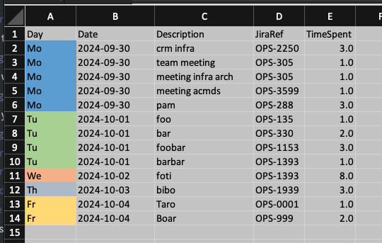
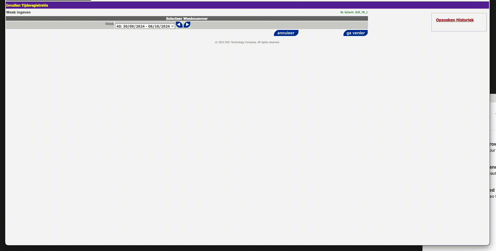

# Browser with debug tools for manipulation via playwright

```sh
# zshrc
alias chrome="/Applications/Google\ Chrome.app/Contents/MacOS/Google\ Chrome --remote-debugging-port=9222"

chrome
```

```python
async def run(playwright: Playwright):
    browser = await playwright.chromium.connect_over_cdp("http://localhost:9222")
    return browser
```

# Playwright browser to 'autogenerate' code
Doesn't work too well, but can be helpful in some instances

```sh
playwright codegen https://kiara.vlaanderen.be
```

# How to?
Input = xlsx file formatted as such.

Column A is optional



## Run debug chrome

```sh
chrome # assuming alias is set, see above if not
```

## Navigate to Kiara and authenticate with ACM/IDM
Make sure you're on the landing page:


## Run the script

```sh
py main.py
```



Gif made with:
```sh
ffmpeg -i ~/Documents/Screenshots/Screen\ Recording\ 2024-10-09\ at\ 22.08.42.mov -pix_fmt rgb8 -r 10 output.gif && gifsicle -O3 output.gif -output.gif
```