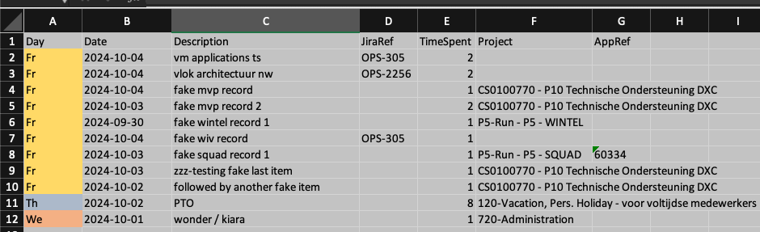
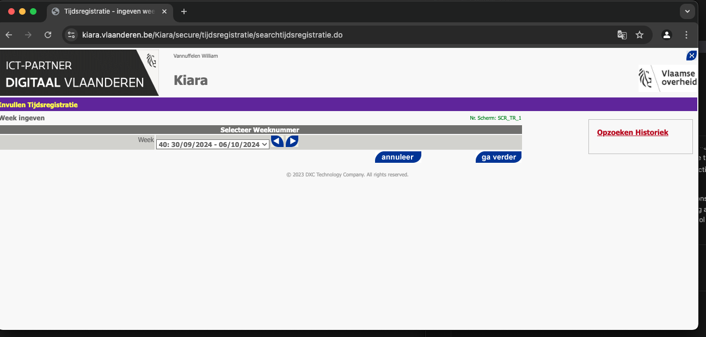
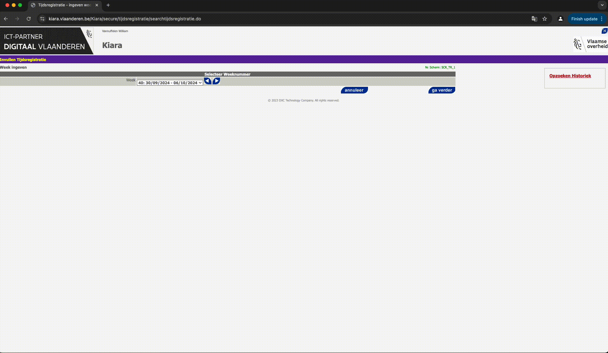

# Browser with debug tools for manipulation via playwright


## Boot up headful chrome browser with debugging enabled
```sh
# zshrc
alias chrome="/Applications/Google\ Chrome.app/Contents/MacOS/Google\ Chrome --remote-debugging-port=9222"

chrome
```

## playwright plugs into this:

Required due to MFA layer preventing full automation.
```python
async def run(playwright: Playwright):
    browser = await playwright.chromium.connect_over_cdp("http://localhost:9222")
    return browser
```

# Snippet to use playwright browser to 'autogenerate' code
Doesn't work too well, but can be helpful in some instances during development.

```sh
playwright codegen https://kiara.vlaanderen.be
```

# How to - Update Kiara timesheets
Input = xlsx file formatted as such.

Column A is optional

- Date in yyyy-MM-dd format
- Description is the name of the line item in Kiara
- JiraRef is optional, used for WiV bookings
- Timespent in hours, minimum increments of .25 hours
- Project is the name of the WBS
- AppRef is optional. Used for AMaaS application bookings.

()

## Run debug chrome

```sh
chrome # assuming alias is set, see above if not
```

## Navigate to Kiara and authenticate with ACM/IDM
Make sure you're on the landing page in the chrome debug browser:



## Run the script

`-f`, `--file_name` = path to the input file

`-s`, `--sheet_name` = path to the input sheet

```sh
py main.py -f ./t_upload.xlsx  -s 2024-09-30
```



Gif made with:
```sh
ffmpeg -i ~/Documents/Screenshots/Screen\ Recording\ 2024-10-09\ at\ 22.08.42.mov -pix_fmt rgb8 -r 10 output.gif && gifsicle -O3 output.gif -output.gif
```

# Changelog

# 1.0.0

- Added support for arbitrary projects
- Added support for AMaaS Project bookings
- Added support for non-project bookings

# 0.0.2
- Added some logging
- Added some exception handling
- Refactored to be modular

# 0.0.1

- No logging
- No exception handling
- No support for multiple projects (= tasks) yet
- No arg parsing yet - has hardcoded project name & input file values.
