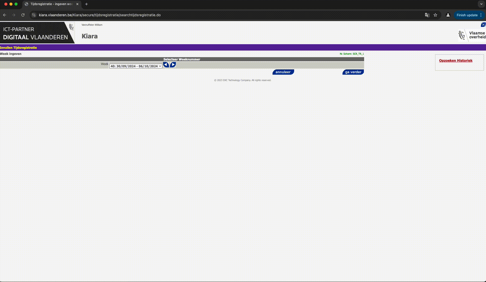
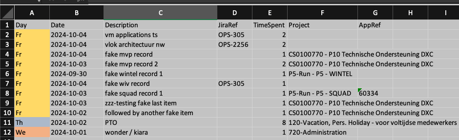

# Kiara Timesheet automation
Tool to enter timesheets in Kiara programatically.



# How does it work?

- Sources timesheet entries from an Excel file

- Uses playwright to automate actions in the browser

- Supports multiple projects and non-project bookings (e.g. PTO)

Has two workflows:

1. Externally launched browser
2. Internally launched browser

## Externally launched browser

You must launch a debug-enabled chrome browser, navigate to Kiara and authenticate with ACM/IDM before running the script.

The script will enter all timesheet info and release control of the browser when it's done. You're free to save timesheets provisionally or close the week.

### Known issues
Sometimes the browser context bugs out and playwright's context array is completely empty.

Opening and closing Kiara tabs a few times fixes it. Once it's fixed inside a browser process it'll continue to work until the process is terminated.

## Internally launched browser

The script will launch a headful chrome browser and navigate to Kiara by itself. You only need to confirm the MFA prompt.

Note: Only supports itsme authentication.

Once the script is done, control is relinquished to the end user to submit or discard the timesheet entries.

### Known issues
Popups are broken in this workflow. You're only able to submit the timesheets provisionally. To cancel, simply terminate the browser and script.

# Configuration

The script supports two methods of parameter input:

## Config file

Located at `./src/config/config.ini`.

Rename the dummy `./src/config/config_template.ini` to `./src/config/config.ini` after cloning the repository.

```ini
[General]
# If auto_submit is false: This project will be opened at the end of the script execution for easy validation
# of the supplied time entries.
preferred_project = CS0126444 - Wonen Cloudzone - dedicated operationeel projectteam
# Not required unless launch_type = external
# Will be used to trigger MFA response from itsme
# don't add prefix 0, don't add country code
phone_number = 473666666

# If true, the script will automatically submit the time entries provisionally at the end of the script execution.
# it will never permanently close the week
# If false, the script will terminate on the timesheet entry page where you can view the submitted entries
auto_submit = true # | false

[Browser]
# internal = Launch a headful browser from inside the script
# external = connect to existing browser session using the debug port 9222
launch_type = external # | internal
# Adds statements to wait toggle projects and wait for a full page reload when adding new work items
# This is required in certain instances due to how Kiara flushes new items to the DOM
# Recommendation is to start with false and only enable if needed.
safe_mode = false # true | false

[Logging]
log_level = debug # | info | warning | error

[Input]
input_file = ~/wvl/devel/tempo/t_upload.xlsx
```

## Command line arguments

`-f`, `--file_name` = path to the input file

`-s`, `--sheet_name` = name of the input sheet

# How to use the script

Input = xlsx file formatted as such.

Column A is optional

- `Date` in yyyy-MM-dd format
- `Description` is the name of the line item in Kiara
- `JiraRef` is optional, used for WiV bookings
- `Timespent` in hours, minimum increments of .25 hours
- `Project` is the name of the WBS
- `AppRef` is optional. Used for AMaaS application bookings.

()


## Internally launched browser

### 1. Just run the script:

```sh
py main.py -f ./t_upload.xlsx  -s 2024-09-30
```

## Externally launched browser

### 1. Run headful debug-enabled chrome
```sh
# .zshrc
alias chrome="/Applications/Google\ Chrome.app/Contents/MacOS/Google\ Chrome --remote-debugging-port=9222"

chrome
```

### 2. Navigate to Kiara and authenticate with ACM/IDM
Make sure you're on the landing page in the chrome debug browser:


### 3. Run the script
```sh
py main.py -f ./t_upload.xlsx  -s 2024-09-30
```

Gifs made with:
```sh
ffmpeg -i ~/Documents/Screenshots/Screen\ Recording\ 2024-10-09\ at\ 22.08.42.mov -pix_fmt rgb8 -r 10 output.gif && gifsicle -O3 output.gif -output.gif
```

# Installation

## 1. Install python 3.12

# ! *NOTE*: 3.13 does not work - dependency greenlet will fail to build

## 2. Clone the repo
```sh
git clone https://github.com/WilliamVannuffelen/kiara_automation.git && cd kiara_automation
```

## 3. Create and activate a venv
```sh
python3.12 -m venv kiara
source ./kiara/bin/activate
```

## 4. Install packages
```sh
py -m pip install -r requirements.txt
```

## 5. Rename `./src/config/config_template.ini` to `./src/config/config.ini` and set desired values

## All done - ready to run the script.

# Changelog

# 1.0.2
- Added optional 'safe_mode' flag. Solves edge case issues with new work item creation.

# 1.0.1
- Added support for internally launched browser

# 1.0.0

- Added support for arbitrary projects
- Added support for AMaaS Project bookings
- Added support for non-project bookings

# 0.0.2
- Added some logging
- Added some exception handling
- Refactored to be modular

# 0.0.1

- No logging
- No exception handling
- No support for multiple projects (= tasks) yet
- No arg parsing yet - has hardcoded project name & input file values.
